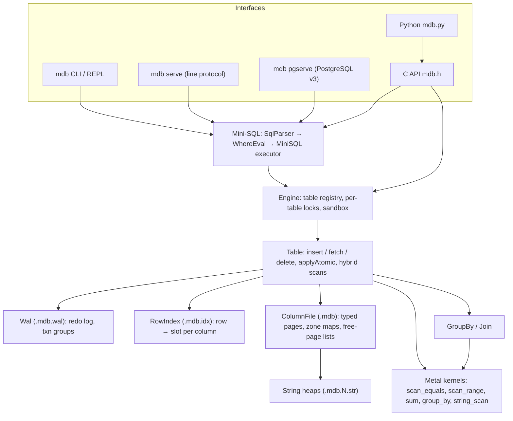

# MetalDB

A GPU-accelerated, column-oriented database engine for Apple Silicon, written in C++17.
Scans, range filters, sums, and group-bys run as Metal compute kernels once a column is
large enough to benefit, with automatic CPU fallback everywhere else. The engine can run
on Linux with every GPU path on the CPU.

```text
$ ./mdb pgserve 5433 --data-dir /srv/metaldb &
$ psql -h 127.0.0.1 -p 5433 -c "SELECT c1, count(*), avg(c2) FROM 'orders' WHERE c3 >= 100 GROUP BY c1"
```

## Highlights

- **Hybrid GPU/CPU execution**: equality and range scans, string equality, column sums,
  and hash group-by dispatch to Metal kernels above a row threshold. Per-page zone maps
  prune range scans before any data is read.
- **SQL**: `SELECT` with boolean `WHERE` trees (`AND`/`OR`/`NOT`, `IN`, `BETWEEN`, `!=`) on
  every column type, multi-key `GROUP BY`, `DISTINCT`, `ORDER BY`, `LIMIT`/`OFFSET`, plus
  `INSERT`, `UPDATE`, `DELETE`, `CREATE TABLE`, `COPY` (CSV), `DESCRIBE`, and `EXPLAIN`
  with per-predicate access paths and timings.
- **PostgreSQL wire protocol**: `psql`, psycopg 3, psycopg2 and other drivers connect
  unchanged, including prepared statements with binary parameters and results, and
  server-side cursors. Columns have typed OIDs, errors carry SQLSTATE codes, and psql's
  `\dt` / `\d table` and `information_schema` work.
- **Durability**: a redo-only write-ahead log with checksummed records. Every statement is
  one WAL transaction, so a crash never leaves a half-applied `INSERT`, `UPDATE`, or
  `DELETE`. Synchronous commit is optional, and explicit checkpoints are available.
- **Concurrent server**: one thread per connection over a shared engine, with per-table
  statement locks, connection limits, idle timeouts, a data-directory sandbox, and
  graceful shutdown that checkpoints every table. Tested under ThreadSanitizer.
- **Operations tooling**: `mdb verify` (integrity checker), `mdb stats`, checksummed
  `mdb backup` / `mdb restore`, and `mdb compact`.
- **Embeddable**: C++ `Engine`, a stable C API (`mdb.h`), and Python bindings (`ctypes`).
- **Typed columns**: `UINT32`, `INT64`, `FLOAT`, `DOUBLE`, `STRING` (variable-length heap).

## Architecture



| Layer | Files |
|-------|-------|
| SQL front end | `SqlAst.hpp`, `SqlParser.cpp`, `WhereEval.cpp`, `MiniSQL.cpp`, `Csv.cpp` |
| Servers | `Server.cpp` (accept loop, line protocol), `PgWire.cpp` (PostgreSQL) |
| Engine / tables | `Engine.cpp`, `Table.cpp`, `GroupBy.cpp`, `Join.cpp` |
| Storage | `ColumnFile.cpp`, `Column.hpp`, `RowIndex.cpp`, `MasterPage.cpp`, `Wal.cpp` |
| GPU | `gpu_*.metal` (kernels), `gpu_*.mm` (host code), `gpu_cpu_stub.cpp` (portable build) |
| Tooling / APIs | `TableTools.cpp`, `mdb.cpp`, `mdb_c.cpp` + `mdb.h`, `python/mdb.py` |

## Building

On an Apple Silicon Mac (Xcode command line tools and the Metal toolchain installed):

```bash
make            # shaders (.metallib), CLI, and test binaries
make run        # full test suite, including the GPU kernels
./src/mdb repl
```

On Linux, in CI, or on a Mac without the Metal toolchain:

```bash
make cpu-run    # portable CPU-only build + 27 test binaries + Python bindings tests
./src/build-cpu/mdb repl
```

The portable build links `gpu_cpu_stub.cpp` in place of the Metal sources, so every
hybrid path takes its CPU branch. GitHub Actions runs it on Linux (gcc and clang) and
macOS.

## Using it

```sql
CREATE TABLE '/tmp/orders' (c0 UINT32, c1 STRING, c2 DOUBLE, c3 UINT32);
INSERT INTO '/tmp/orders' VALUES (1, 'north', 19.99, 3), (2, 'south', 5.25, 12), (3, 'north', 120.0, 1);
COPY '/tmp/orders' FROM '/data/orders.csv' WITH HEADER;

SELECT c1, count(*), sum(c2), avg(c2)
FROM '/tmp/orders'
WHERE (c3 >= 2 OR c1 IN ('west', 'north')) AND NOT c2 BETWEEN 0 AND 1
GROUP BY c1
ORDER BY 3 DESC
LIMIT 10;

UPDATE '/tmp/orders' SET c3 = 0 WHERE c1 = 'south';
EXPLAIN SELECT c0 FROM '/tmp/orders' WHERE c3 > 10;
COPY (SELECT c1, c2 FROM '/tmp/orders' ORDER BY c2 DESC) TO '/tmp/top.csv' WITH HEADER;
```

Tables are named by quoted base paths (or by names relative to `--data-dir` in server
mode), and columns are positional (`c0`, `c1`, ...). The full grammar and its limits are
in [docs.md](docs.md).

From Python:

```python
from mdb import Engine
with Engine() as e:
    r = e.query("SELECT c1, count(*) FROM '/tmp/orders' GROUP BY c1")
    print(r.columns, r.rows)     # ['c1', 'count(*)'] [('north', 2), ('south', 1)]
```

Operations:

```bash
mdb verify  /tmp/orders            # exit 2 on corruption
mdb stats   /tmp/orders
mdb backup  /tmp/orders /backups/orders-2026-09-27
mdb restore /backups/orders-2026-09-27 /tmp/orders_restored
mdb compact /tmp/orders
```

## Design notes

- **Storage**: each column is a chain of fixed-size pages inside the table's `.mdb` file.
  A page holds typed values, a used-slot map, and a zone map (min/max). Rows are
  addressed through a row index that maps each row ID to one slot per column. Writes
  update only the changed slot bytes and the page header.
- **Durability**: the WAL is redo-only. `Table::applyAtomic` validates rows and checks
  capacity (page-ID space and heap size), logs the whole statement, writes the commit
  record, and only then touches the base files. Recovery replays committed groups
  idempotently on open and discards torn ones.
- **GPU kernels**: Metal has no 64-bit device atomics, so group-by sums are kept as
  `(lo, hi)` 32-bit atomic pairs with carry detection. The hash table reports overflow
  rather than dropping rows, and the host retries with a larger table. Results are
  always cross-checked against the CPU path in the tests.
- **Concurrency**: `Table` objects aren't thread-safe (reads populate page caches), so the
  engine serializes statements per table and lets different tables run in parallel.

## Limits

- A table holds at most 65,535 pages across all columns (16-bit page IDs). That's about
  8.9M rows for a 6-column table with 4 KiB pages; larger page sizes raise it. Each
  STRING column's heap is capped at 4 GiB. Hitting either limit raises an error before
  anything is written.
- There are no multi-statement transactions and no NULLs. Joins are available through the
  C++ and C APIs but not in SQL.
- The PostgreSQL server has no TLS, SCRAM auth, or `COPY ... STDIN`.
- GPU kernels operate on `UINT32` (and string equality). Other types run on the CPU.

## Project status

See [PROGRESS.md](PROGRESS.md) for a phase-by-phase log with the bugs found and fixed
along the way, and [ROADMAP.md](ROADMAP.md) for what's next.
